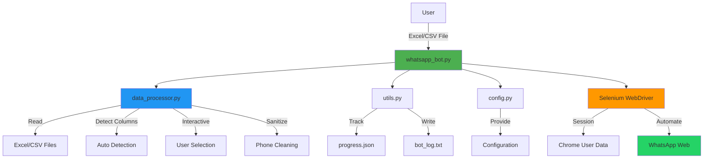
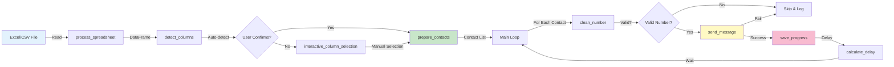
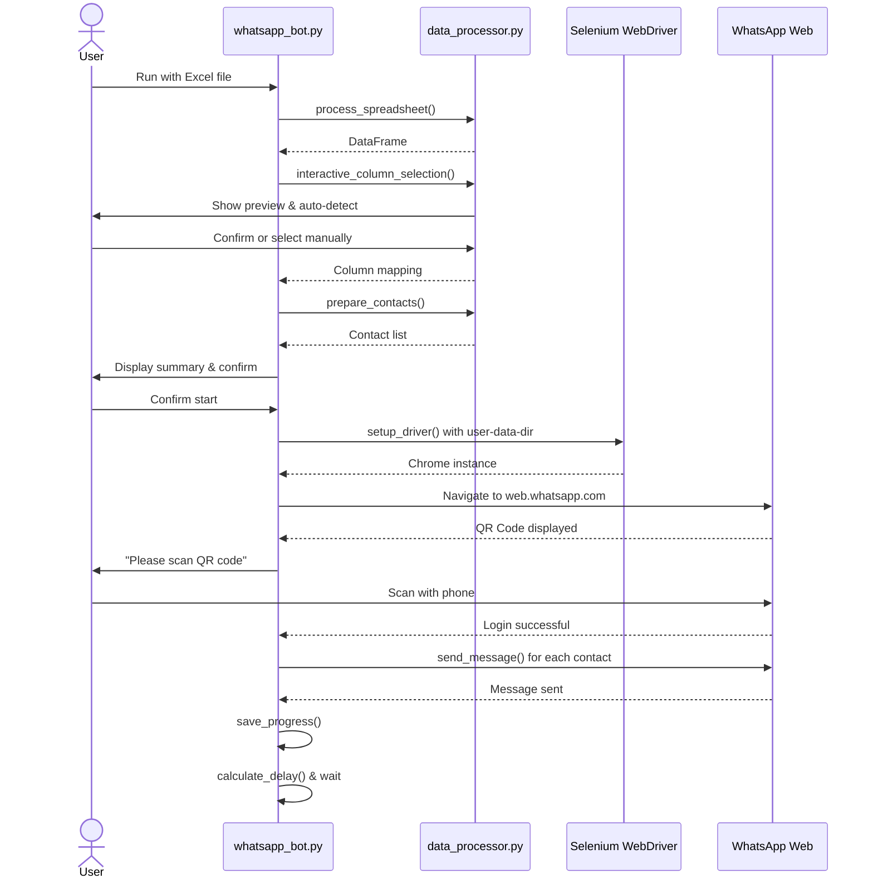
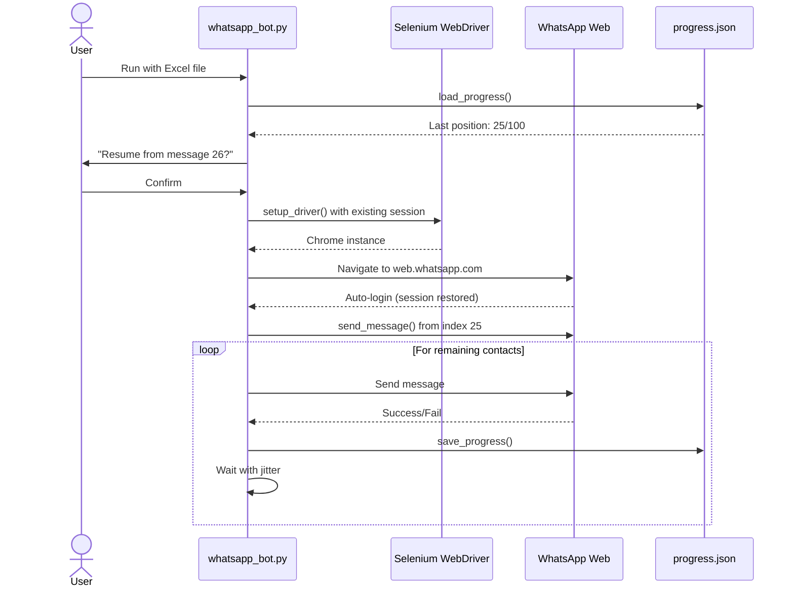
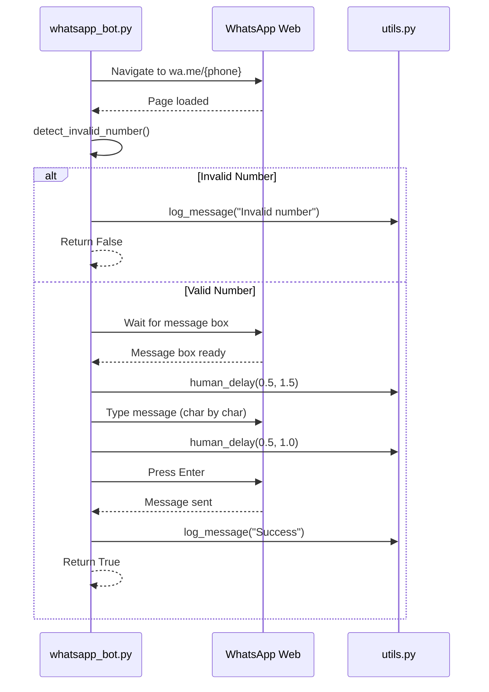

# WhatsApp Bot Blasting System - Architecture

## System Overview

The WhatsApp Bot Blasting System is a production-ready automation framework designed to send bulk WhatsApp messages via web.whatsapp.com using Selenium WebDriver. The system emphasizes safety, reliability, and user experience through intelligent design patterns and anti-ban mechanisms.

## Architecture Diagram



## Component Architecture

### 1. Core Modules

#### whatsapp_bot.py (Main Orchestrator)

**Responsibilities:**

- Application entry point and workflow orchestration
- Selenium WebDriver initialization and lifecycle management
- WhatsApp Web interaction and message sending
- Progress tracking and error recovery

**Key Functions:**

- `setup_driver()`: Initialize Chrome with session persistence
- `wait_for_whatsapp_load()`: Handle QR login and session restoration
- `send_message()`: Core message sending with human-like behavior
- `detect_invalid_number()`: Identify non-existent WhatsApp numbers
- `main()`: Complete execution workflow

#### data_processor.py (Data Layer)

**Responsibilities:**

- Multi-format data ingestion (CSV, Excel)
- Intelligent column detection with pattern matching
- Interactive user interface for column selection
- Phone number extraction and sanitization

**Key Functions:**

- `process_spreadsheet()`: Universal file reader
- `detect_columns()`: Auto-detection with confidence scoring
- `interactive_column_selection()`: CLI interface with preview
- `clean_number()`: Phone sanitization and normalization
- `prepare_contacts()`: Contact list preparation

#### utils.py (Utilities Layer)

**Responsibilities:**

- Timing and delay calculations
- Logging infrastructure
- Progress persistence
- Validation utilities

**Key Functions:**

- `calculate_delay()`: Anti-ban delay with jitter
- `log_message()`: Colored console + file logging
- `save_progress()` / `load_progress()`: Resume capability
- `validate_phone_number()`: Format validation

#### config.py (Configuration Layer)

**Responsibilities:**

- Centralized configuration management
- XPath selector definitions
- Timing parameters
- Safety limits

**Key Constants:**

- Timing: `BASE_DELAY`, `JITTER_MIN/MAX`, `WARMUP_DELAY`
- XPaths: `XPATH_MESSAGE_BOX`, `XPATH_SEND_BUTTON`, etc.
- Patterns: Phone/name/message column detection patterns

## Data Flow Diagram



## Sequence Diagrams

### First-Time Execution (QR Login)



### Subsequent Execution (Auto-Login)



### Message Sending Workflow



## Technical Design Decisions

### 1. Session Persistence Strategy

**Problem:** WhatsApp Web requires QR code scan on every new session, which is impractical for automation.

**Solution:** Use Chrome's `user-data-dir` to persist session data.

```python
options.add_argument(f"user-data-dir={session_path}")
```

**Benefits:**

- QR scan only once
- Faster subsequent runs
- Better user experience

### 2. Anti-Ban Timing Algorithm

**Problem:** Sending messages too quickly triggers WhatsApp's rate limiting and can result in account bans.

**Solution:** Multi-layered delay strategy:

```python
def calculate_delay(message_count):
    delay = BASE_DELAY  # 60s

    # Warm-up: slower for first 5 messages
    if message_count < WARMUP_COUNT:
        delay += WARMUP_DELAY  # +90s

    # Randomized jitter
    delay += random.uniform(JITTER_MIN, JITTER_MAX)  # +5-15s

    return delay
```

**Timing Profile:**

- Messages 1-5: 155-165 seconds (warm-up)
- Messages 6+: 65-75 seconds (normal)

### 3. Robust XPath Selectors

**Problem:** WhatsApp Web's DOM structure changes frequently, breaking automation.

**Solution:** Use relative XPath with data attributes:

```python
XPATH_MESSAGE_BOX = '//div[@contenteditable="true"][@data-tab="10"]'
XPATH_SEND_BUTTON = '//span[@data-icon="send"]'
```

**Benefits:**

- More resilient to UI changes
- Faster element location
- Better maintainability

### 4. Interactive Column Selection

**Problem:** Excel files have varying column structures; hardcoding column names fails.

**Solution:** Two-tier approach:

1. **Auto-detection** with pattern matching
2. **Manual selection** fallback with preview

```python
# Auto-detect
detected = detect_columns(df)

# User confirmation
if not all(detected.values()):
    selected = interactive_column_selection(df)
```

**Benefits:**

- Works with any Excel structure
- User-friendly for non-technical users
- Reduces configuration overhead

### 5. Progress Persistence

**Problem:** Long-running tasks can be interrupted; restarting from beginning wastes time and risks duplicate sends.

**Solution:** JSON-based progress tracking:

```python
{
  "file": "contacts.xlsx",
  "total": 100,
  "processed": 25,
  "success": 23,
  "failed": 2,
  "last_update": "2026-01-03T22:00:00"
}
```

**Benefits:**

- Resume from exact position
- Prevents duplicate sends
- Audit trail for debugging

## Security and Safety Considerations

### 1. Rate Limiting

- Maximum 100 messages per session (configurable)
- Mandatory delays between messages
- Warm-up period for new sessions

### 2. Invalid Number Handling

- Automatic detection of non-existent numbers
- Skip and log instead of retry
- Prevents wasted time and potential flags

### 3. Human-like Behavior

- Randomized typing speed
- Variable delays between actions
- Natural pauses after punctuation

### 4. Error Recovery

- Try-catch blocks around critical operations
- Graceful degradation on failures
- Detailed logging for debugging

### 5. User Confirmation

- Summary display before execution
- Explicit confirmation required
- Safety limit warnings

## Performance Characteristics

### Throughput

- **With warm-up (first 5 messages):** ~160 seconds/message
- **Normal operation:** ~70 seconds/message
- **100 messages:** ~2 hours estimated

### Resource Usage

- **Memory:** ~200-300 MB (Chrome + Python)
- **CPU:** Low (mostly idle waiting)
- **Network:** Minimal (text messages only)

### Scalability

- **Current limit:** 100 messages/session (safety)
- **Technical limit:** Thousands (not recommended)
- **Bottleneck:** WhatsApp rate limiting, not system

## Extension Points

### Future Enhancements

1. **Multi-media Support**

   - Image attachments
   - Document sending
   - Video messages

2. **Advanced Scheduling**

   - Time-based sending
   - Timezone awareness
   - Batch scheduling

3. **Analytics Dashboard**

   - Delivery rates
   - Response tracking
   - Performance metrics

4. **Template System**

   - Message templates with variables
   - Personalization engine
   - A/B testing

5. **Multi-account Support**
   - Multiple WhatsApp accounts
   - Load balancing
   - Failover handling

## Deployment Considerations

### Development Environment

- Windows 10/11
- Python 3.8+
- Chrome browser
- Virtual environment (.venv)

### Production Recommendations

- Dedicated machine (avoid interruptions)
- Stable internet connection
- Monitoring and alerting
- Regular backups of session data

### Maintenance

- Update Chrome regularly
- Monitor WhatsApp Web changes
- Review logs for patterns
- Adjust timing if needed

---

**Architecture Version:** 1.0  
**Last Updated:** 2026-01-03  
**Author:** Senior Python Automation Engineer
